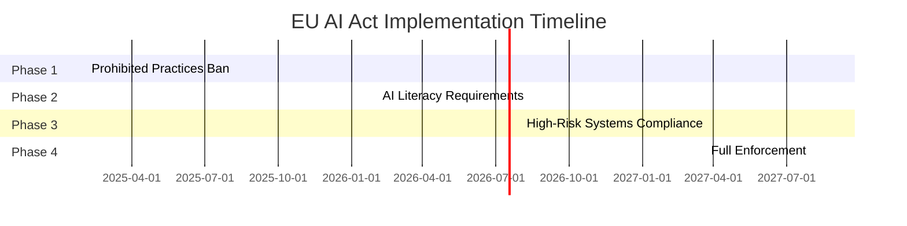

## What is the EU AI Act?

The **EU Artificial Intelligence Act** (Regulation EU 2024/1689) is the world's first comprehensive legal framework for artificial intelligence. It came into force on August 1, 2024, with phased implementation through 2026.

<Note>
  The EU AI Act applies to **any company** offering AI systems in the EU market, regardless of where the company is based.
</Note>

## Risk-Based Approach

The Act categorizes AI systems into four risk levels:

<Tabs>
  <Tab title="Unacceptable Risk" icon="ban">
    **Prohibited AI Practices**
    
    These AI systems are banned outright:
    - Social scoring by governments
    - Real-time biometric identification in public spaces (with exceptions)
    - Emotion recognition in workplace/education
    - Manipulation of human behavior causing harm
    - Exploiting vulnerabilities of specific groups
    
    ⚠️ **Penalties**: Up to €35M or 7% of global turnover
  </Tab>

  <Tab title="High Risk" icon="triangle-exclamation">
    **High-Risk AI Systems**
    
    Require strict compliance:
    - **Critical Infrastructure**: Transport, energy, water
    - **Education**: Exam scoring, admissions
    - **Employment**: Recruitment, performance evaluation
    - **Essential Services**: Credit scoring, emergency services
    - **Law Enforcement**: Evidence evaluation, predictive policing
    - **Migration & Asylum**: Application assessment
    - **Justice**: Case prioritization, risk assessments
    
    ⚠️ **Penalties**: Up to €15M or 3% of global turnover
  </Tab>

  <Tab title="Limited Risk" icon="info-circle">
    **Transparency Obligations**
    
    Must disclose AI usage:
    - Chatbots and virtual assistants
    - Content recommendation systems
    - Emotion recognition systems
    - Biometric categorization
    - AI-generated content (deepfakes)
    
    Users must be informed they're interacting with AI
  </Tab>

  <Tab title="Minimal Risk" icon="check-circle">
    **No Specific Obligations**
    
    Examples:
    - Spam filters
    - Video game AI
    - Inventory management systems
    
    Voluntary codes of conduct encouraged
  </Tab>
</Tabs>

## Key Requirements for High-Risk AI

If your AI system is classified as high-risk, you must:

### 1. Risk Management System

<Steps>
  <Step title="Identify Risks">
    Document potential risks throughout the AI lifecycle
  </Step>

  <Step title="Risk Mitigation">
    Implement measures to eliminate or reduce risks to acceptable levels
  </Step>

  <Step title="Residual Risk Evaluation">
    Assess remaining risks after mitigation
  </Step>

  <Step title="Continuous Monitoring">
    Test and update risk management throughout deployment
  </Step>
</Steps>

### 2. Data Governance

High-quality training data requirements:

<AccordionGroup>
  <Accordion title="Data Quality" icon="database">
    - Relevant, representative, and free of errors
    - Appropriate statistical properties
    - Consider biases and limitations
  </Accordion>

  <Accordion title="Data Sources" icon="folder-open">
    - Document data collection processes
    - Maintain data provenance records
    - Ensure GDPR compliance
  </Accordion>

  <Accordion title="Bias Mitigation" icon="scale-balanced">
    - Examine training data for biases
    - Implement bias detection and correction
    - Regular bias testing and monitoring
  </Accordion>
</AccordionGroup>

### 3. Technical Documentation

Must maintain comprehensive technical documentation:

```markdown
Required Documentation:
├── General Description
│   ├── Intended purpose
│   ├── Risk classification
│   └── Deployment conditions
├── Technical Specifications
│   ├── System architecture
│   ├── Data requirements
│   └── Model details
├── Risk Management
│   ├── Risk assessment
│   ├── Mitigation measures
│   └── Residual risks
├── Data Governance
│   ├── Training data description
│   ├── Data quality metrics
│   └── Bias assessments
└── Testing & Validation
    ├── Test procedures
    ├── Validation results
    └── Performance metrics
```

### 4. Record Keeping

Automatic logging requirements:

- **Operation Logs**: All significant events during operation
- **User Interactions**: Complete audit trail
- **Performance Data**: Accuracy, errors, and anomalies
- **Incident Records**: Malfunctions and corrective actions

<Note>
  **RegPilot automatically handles this** through the AI Gateway logging system.
</Note>

### 5. Transparency & Information

Provide clear information to users:

<CardGroup cols={2}>
  <Card title="User Instructions" icon="book">
    - Operating instructions
    - System capabilities and limitations
    - Expected performance levels
    - Known risks
  </Card>

  <Card title="Technical Specifications" icon="cog">
    - Input/output formats
    - Performance metrics
    - Hardware requirements
    - Integration guidelines
  </Card>
</CardGroup>

### 6. Human Oversight

High-risk systems must allow for:

- Ability to stop or interrupt the system
- Disregard, override, or reverse AI decisions
- Real-time monitoring capabilities
- Clear responsibility assignment

### 7. Accuracy, Robustness & Cybersecurity

Ensure:

- **Accuracy**: Achieve and maintain specified performance levels
- **Robustness**: Resilience against errors, faults, and inconsistencies
- **Security**: Protection against unauthorized access or manipulation

## How RegPilot Helps You Comply

<CardGroup cols={2}>
  <Card title="Automatic Classification" icon="sitemap">
    RegPilot helps determine your AI system's risk level based on its intended use
  </Card>

  <Card title="Documentation Generator" icon="file-text">
    Auto-generate required technical documentation from your AI systems
  </Card>

  <Card title="Automated Logging" icon="list">
    Complete audit trail of all AI interactions through AI Gateway
  </Card>

  <Card title="Bias Detection" icon="scale-balanced">
    Built-in bias monitoring and fairness metrics in analytics dashboard
  </Card>

  <Card title="Risk Management" icon="shield">
    Track and manage compliance risks with the violations system
  </Card>

  <Card title="Transparency Tools" icon="eye">
    Generate user-facing disclosures and compliance statements
  </Card>
</CardGroup>

## Implementation Timeline

The EU AI Act has a phased implementation:



<Warning>
  **Start preparing now!** Even if full compliance isn't required until 2026, beginning implementation early reduces risk and demonstrates due diligence.
</Warning>

## Compliance Checklist

Use this checklist to track your compliance progress:

<Steps>
  <Step title="Risk Classification">
    - [ ] Determine AI system risk level
    - [ ] Document classification rationale
    - [ ] Review classification annually
  </Step>

  <Step title="Risk Management">
    - [ ] Establish risk management system
    - [ ] Conduct risk assessments
    - [ ] Implement mitigation measures
    - [ ] Test and validate effectiveness
  </Step>

  <Step title="Data Governance">
    - [ ] Document training data sources
    - [ ] Assess data quality and biases
    - [ ] Implement data protection measures
    - [ ] Establish data governance policies
  </Step>

  <Step title="Technical Documentation">
    - [ ] Create system description
    - [ ] Document technical specifications
    - [ ] Maintain risk management records
    - [ ] Record testing and validation
  </Step>

  <Step title="Logging & Monitoring">
    - [ ] Implement automatic logging
    - [ ] Set up performance monitoring
    - [ ] Establish incident reporting
    - [ ] Create audit procedures
  </Step>

  <Step title="Human Oversight">
    - [ ] Define oversight mechanisms
    - [ ] Assign responsibilities
    - [ ] Implement override capabilities
    - [ ] Train oversight personnel
  </Step>

  <Step title="Transparency">
    - [ ] Create user documentation
    - [ ] Implement AI disclosures
    - [ ] Provide performance information
    - [ ] Establish communication channels
  </Step>
</Steps>

## Common Compliance Scenarios

### Scenario 1: Customer Service Chatbot

**Risk Level**: Limited Risk (transparency obligations)

**Requirements**:
- Disclose to users they're interacting with AI
- Provide option to escalate to human
- Log conversations for quality assurance

**RegPilot Solution**:
```typescript
// Automatic disclosure with RegPilot
const response = await regpilot.chat.create({
  messages: [...],
  metadata: {
    disclosureType: 'chatbot',
    escalationAvailable: true
  }
});

// Response includes disclosure text
console.log(response.disclosure); 
// "You are chatting with an AI assistant..."
```

### Scenario 2: HR Recruitment Tool

**Risk Level**: High Risk

**Requirements**:
- Full EU AI Act compliance
- Risk management system
- Bias testing and monitoring
- Technical documentation
- Human oversight

**RegPilot Solution**:
- Register model in Models Registry
- Enable Governor for all interactions
- Automatic compliance documentation
- Bias detection in analytics
- Complete audit trail

### Scenario 3: Content Recommendation

**Risk Level**: Limited Risk (transparency)

**Requirements**:
- Inform users about AI-powered recommendations
- Allow users to opt-out or customize

**RegPilot Solution**:
```typescript
// Include transparency metadata
const recommendations = await regpilot.complete({
  prompt: "Generate recommendations for user",
  transparency: {
    type: 'recommendation_system',
    customizable: true
  }
});
```

## Penalties for Non-Compliance

The EU AI Act includes substantial penalties:

| Violation | Fine |
|-----------|------|
| **Prohibited AI practices** | Up to €35M or 7% of global turnover |
| **Non-compliance (high-risk)** | Up to €15M or 3% of global turnover |
| **Incorrect information to authorities** | Up to €7.5M or 1.5% of global turnover |

<Warning>
  Penalties are based on the **higher amount** between the fixed sum and percentage of turnover.
</Warning>

## Resources

<CardGroup cols={2}>
  <Card
    title="Official EU AI Act Text"
    icon="file-pdf"
    href="https://eur-lex.europa.eu/legal-content/EN/TXT/?uri=CELEX:32024R1689"
  >
    Read the complete regulation
  </Card>

  <Card
    title="RegPilot Risk Assessment Tool"
    icon="calculator"
    href="https://regpilot.dev/risk-assessment"
  >
    Determine your AI system's risk level
  </Card>

  <Card
    title="Compliance Templates"
    icon="file-text"
    href="/compliance/documentation-requirements"
  >
    Download documentation templates
  </Card>

  <Card
    title="Contact Compliance Experts"
    icon="envelope"
    href="mailto:compliance@regpilot.com"
  >
    Get personalized guidance
  </Card>
</CardGroup>

## Next Steps

<Steps>
  <Step title="Classify Your AI Systems">
    Use our risk assessment tool to determine which systems need compliance
  </Step>

  <Step title="Start Monitoring">
    Integrate RegPilot AI Gateway to begin automatic compliance logging
  </Step>

  <Step title="Generate Documentation">
    Use RegPilot's documentation generator for required technical docs
  </Step>

  <Step title="Regular Review">
    Schedule quarterly compliance reviews and updates
  </Step>
</Steps>

<Note>
  **Need personalized guidance?** Our compliance experts can help assess your specific situation and create a compliance roadmap. [Contact us](mailto:compliance@regpilot.com).
</Note>
